# FixKart Master Architecture Specification (`FIXKART_ARCHITECTURE.md`)

## 1. Executive Summary & System Overview

FixKart is a Quick-Commerce Plumbing & Home Repair Platform built as a modular multi-application system. The platform orchestrates real-time plumbing service requests, material requirements, store inventory fulfillment, and self-pickup workflows across three dedicated mobile/web applications and a central management administration portal.

```text
Repository: plumbing-qcommerce
Branch: Development
HEAD Commit: b2dacdb0dd17fdaa2ccc287e224b30dcb726501c
System Classification: Layered / Modular Monolith with Decoupled Frontend Applications
```

### System Architecture Diagram
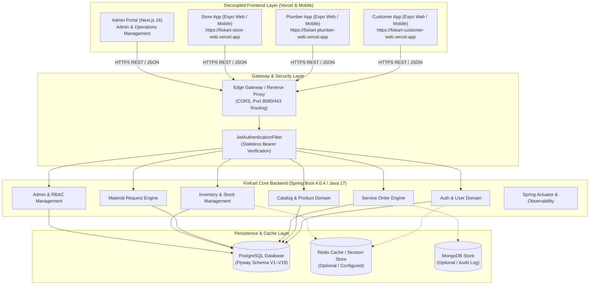

---

## 2. Top-Level Repository & Module Architecture

| Module | Purpose | Technology Stack | Entry Point | Build System | Deployment Target | Communication Dependencies |
| --- | --- | --- | --- | --- | --- | --- |
| `backend` | Core REST APIs, Business Rules, DB Migrations, Security, State Machines | Java 17, Spring Boot 4.0.4, Spring Security 6.x, Spring Data JPA | `PlumbingCoreApplication.java` | Maven (`pom.xml`) | Render (`onrender.com`) | PostgreSQL, Redis, Google Auth, Actuator |
| `customer-app` | Customer booking, product catalog, cart, checkout, live job tracking | React Native 0.83, Expo 55, TypeScript 5.9, Redux Toolkit 2.12 | `index.ts` / `App.tsx` | Expo Web / Metro | Vercel (`vercel.app`) | Backend REST API (`/api/v1`) |
| `plumber-app` | Plumber job dispatch, en-route tracking, material requests, self-pickup | React Native 0.83, Expo 55, TypeScript 5.9, Redux Toolkit 2.12 | `index.ts` / `App.tsx` | Expo Web / Metro | Vercel (`vercel.app`) | Backend REST API (`/api/v1`) |
| `store-app` | Store inventory, order fulfillment, material request approval, pickup confirmation | React Native 0.83, Expo 55, TypeScript 5.9, Redux Toolkit 2.12 | `index.ts` / `App.tsx` | Expo Web / Metro | Vercel (`vercel.app`) | Backend REST API (`/api/v1`) |
| `admin-portal` | Management console for KYC verification, store stock, pricing & RBAC | Next.js 16.2, React 19.2, TailwindCSS 4 | `app/layout.tsx` | Next.js CLI | Vercel (`vercel.app`) | Backend REST API (`/api/v1/admin`) |
| `edge-service` | Reverse proxy & API Gateway configuration | Nginx / Spring Cloud Gateway | `nginx.conf` | Docker / Static | Render Staging | Frontend Applications $\rightarrow$ Backend |

---

## 3. Tech Stack Inventory

| Layer | Technology | Exact Version | Primary Purpose |
| --- | --- | --- | --- |
| **Language Runtime** | Java OpenJDK | `17` | Backend application execution |
| **Framework** | Spring Boot | `4.0.4` | Enterprise REST micro-service framework |
| **Security** | Spring Security | `6.x` | Role-based authorization & filter chain |
| **JWT Library** | JJWT | `0.11.5` | Stateless authentication token generation & parsing |
| **Database ORM** | Spring Data JPA / Hibernate | `Hibernate 6.x` | Object-Relational Mapping for PostgreSQL |
| **Schema Migration** | Flyway | `10.x` | Database versioning & DDL migration management |
| **Relational Database** | PostgreSQL | `15+` | Primary persistent transactional relational database |
| **Caching Engine** | Redis Data Gateway | `redis-starter` | Token caching & transient state management |
| **Document Store** | MongoDB | `mongo-starter` | Auxiliary audit logging & telemetry store |
| **Documentation** | SpringDoc OpenAPI | `2.8.5` | Swagger UI & OpenAPI v3 endpoint documentation |
| **Observability** | Spring Boot Actuator | `4.0.4` | `/health/live`, `/health/ready`, metrics & tracing |
| **Mobile Runtime** | React Native | `0.83.2` / `0.83.6` | Cross-platform mobile & web client framework |
| **App Tooling** | Expo Framework | `~55.0.26` / `55.0.27` | Build system, assets, secure store, linking |
| **Frontend Language** | TypeScript | `~5.9.2` | Static typing across all client applications |
| **Navigation** | React Navigation | `v7` | Stack & Bottom Tab UI navigation routers |
| **State Management** | Redux Toolkit | `^2.12.0` | Global state management for cart, auth, & orders |
| **HTTP Client** | Axios | `^1.18.0` | Promise-based HTTP client with interceptors |
| **Storage Engine** | Expo SecureStore | `^56.0.4` | Encrypted mobile token persistence |

---

## 4. Backend Architecture & Layers

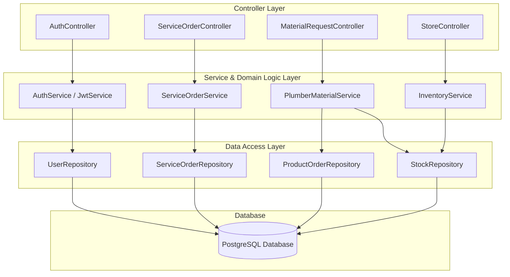

### Backend Package Breakdown
- `com.pqc.core.controller`: 30 `@RestController` classes defining external API endpoints.
- `com.pqc.core.service`: 24 `@Service` components implementing business rules, state transitions, and `@Transactional` boundaries.
- `com.pqc.core.repository`: 25 Spring Data JPA interfaces handling database CRUD and custom query execution.
- `com.pqc.core.entity`: 46 `@Entity` JPA model classes representing database tables.
- `com.pqc.core.dto`: 95 Data Transfer Object classes ensuring strict request/response data contracts.
- `com.pqc.core.security`: JWT filter (`JwtAuthenticationFilter`), token provider (`JwtService`), and user details service (`CustomUserDetailsService`).
- `com.pqc.core.config`: Spring configuration beans for Security, CORS, Swagger, Database, and Web MVC.

---

## 5. Controller & API Architecture

| Controller | Base Route | Purpose | Authorized Roles |
| --- | --- | --- | --- |
| `AuthController` | `/api/v1/auth` | User registration, login, token refresh, current user profile | Public / Authenticated |
| `AuthenticationController` | `/api/auth` | Legacy authentication compatibility endpoints | Public / Authenticated |
| `OtpController` | `/api/v1/auth/otp` | Mobile phone number OTP generation and verification | Public |
| `UserController` | `/api/v1/users` | User profile management, address listing, availability toggle | Authenticated / Roles |
| `UserAddressController` | `/api/v1/users/addresses` | Customer saved address creation, update, and deletion | `CUSTOMER` |
| `CustomerProfileController` | `/api/v1/customers/profile` | Customer profile management and preferences | `CUSTOMER` |
| `PlumberController` | `/api/v1/plumbers` | Plumber availability, job accept/reject, location tracking | `PLUMBER` |
| `PlumberManagerController` | `/api/v1/plumber-manager` | Plumber management, zone dispatching, assignment rules | `PLUMBER_MANAGER`, `ADMIN` |
| `CatalogController` | `/api/v1/catalog` | Categories, products listing, search, and details | Public |
| `StoreController` | `/api/v1/stores` | Store inventory, stock updates, fulfillment, store search | `STORE_MANAGER`, `ADMIN` |
| `CheckoutController` | `/api/v1/checkout` | Customer cart checkout, order placement | `CUSTOMER` |
| `ServiceOrderController` | `/api/v1/service-orders` | Service booking creation, status progression, cancellation | `CUSTOMER`, `PLUMBER`, `ADMIN` |
| `MaterialRequestController` | `/api/v1/materials` | Plumber material requests, store approval, self-pickup | `PLUMBER`, `STORE_MANAGER` |
| `MaterialPickupController` | `/api/v1/materials/pickup` | Store material self-pickup confirmation with OTP | `STORE_MANAGER`, `PLUMBER` |
| `ServiceLogController` | `/api/v1/service-logs` | On-site work progress logs and diagnostic uploads | `PLUMBER` |
| `PaymentController` | `/api/v1/payments` | Payment initiation, verification, and transaction receipts | `CUSTOMER` |
| `WalletController` | `/api/v1/wallet` | Wallet balance, top-ups, plumber earnings, payouts | `CUSTOMER`, `PLUMBER` |
| `NotificationController` | `/api/v1/notifications` | User in-app notifications and alerts | Authenticated |
| `HealthController` | `/health` | Application liveness (`/health/live`) & readiness (`/health/ready`) | Public |
| `VersionController` | `/version` | System build version SHA & environment information | Public |
| `AdminController` | `/api/v1/admin` | Platform overview, dashboard analytics, metrics | `SUPER_ADMIN`, `ADMIN` |
| `AdminRbacController` | `/api/v1/admin/rbac` | User role assignment, RBAC permission configuration | `SUPER_ADMIN`, `ADMIN` |
| `SuperAdminController` | `/api/v1/admin/super` | Super-admin system maintenance, database seed triggers | `SUPER_ADMIN` |

---

## 6. Domain Model & Database Architecture

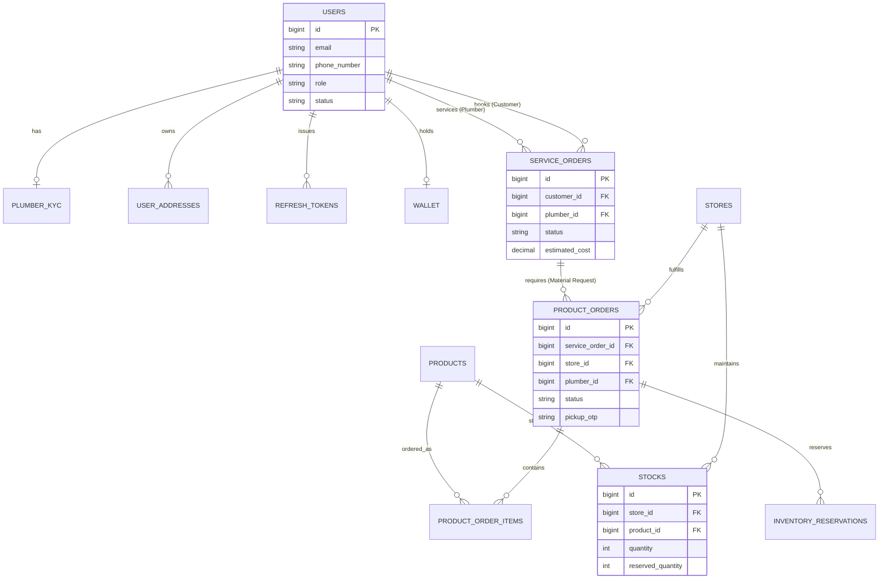

### Database Migration Timeline (Flyway V1–V19)
- **V1 (`V1__init_schema.sql`)**: Core schema creation (`users`, `roles`, `plumber_kyc`, `categories`, `products`, `stores`, `stock`, `service_orders`, `product_orders`, `product_order_items`, `inventory_reservations`, `refresh_tokens`).
- **V2 (`V2__add_user_data_tables.sql`)**: User addresses and service logs execution tracking.
- **V3 (`V3__add_wallet_notifications.sql`)**: In-app wallets, transaction logs, and notification dispatch tables.
- **V4 (`V4__add_user_status.sql`)**: Account status tracking (`ACTIVE`, `INACTIVE`, `BLOCKED`).
- **V5 (`V5__add_finance_admin_tables.sql`)**: Payout settlements and customer refund handling tables.
- **V6 (`V6__add_support_admin_tables.sql`)**: Support tickets and customer message threads.
- **V7 (`V7__add_plumber_manager_tables.sql`)**: Manager assignment tracking for plumber network.
- **V8 (`V8__add_marketing_admin_tables.sql`)**: Marketing banners, promotional campaigns, and discount offers.
- **V9 (`V9__harden_admin_migrations.sql`)**: Database constraint hardening and fallback index optimization.
- **V10 (`V10__expand_users_role_check_for_admin_roles.sql`)**: Extended role constraints (`STORE_MANAGER`, `SUPER_ADMIN`, `PLUMBER_MANAGER`, `FINANCE_ADMIN`, `SUPPORT_ADMIN`, `MARKETING_ADMIN`, `OPERATIONS_ADMIN`).
- **V11 (`V11__align_product_order_status_constraint.sql`)**: Material request status alignment (`REQUESTED`, `APPROVED`, `PREPARING`, `READY_FOR_PICKUP`, `COLLECTED`, `COMPLETED`, `CANCELLED`).
- **V12 (`V12__expand_product_order_delivery_otp_length.sql`)**: OTP code length expansion for secure store pickup.
- **V13 (`V13__add_google_auth_and_profile_completion_fields.sql`)**: Google OAuth ID and profile completion flags.
- **V14 (`V14__add_arrived_at_to_service_orders.sql`)**: `ARRIVED_AT_LOCATION` timestamp tracking for plumbers.
- **V15 (`V15__add_plumber_store_pickup_workflow.sql`)**: Store self-pickup fields (`pickup_otp`, `store_id`, `plumber_id`).
- **V16 (`V16__add_product_order_status_history.sql`)**: Audit history tracking for material orders.
- **V17 (`V17__align_service_order_status_constraint.sql`)**: Service order lifecycle status alignment (`REQUESTED`, `ASSIGNED`, `EN_ROUTE`, `ARRIVED`, `DIAGNOSING`, `MATERIAL_SELECTION`, `WAITING_FOR_MATERIALS`, `IN_PROGRESS`, `COMPLETED`, `CANCELLED`).
- **V18 (`V18__align_reservation_status_constraint.sql`)**: Stock reservation status alignment (`RESERVED`, `FULFILLED`, `CANCELLED`, `RELEASED`).
- **V19 (`V19__add_rating_and_service_order_history.sql`)**: Service order state audit history and customer ratings/reviews.

---

## 7. Authentication & RBAC Architecture

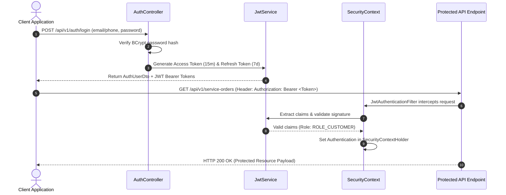

### Role Matrix Architecture
| Resource / Area | CUSTOMER | PLUMBER | STORE_MANAGER | ADMIN / SUPER_ADMIN |
| --- | --- | --- | --- | --- |
| **Catalog Browsing** | Read Only | Read Only | Read Only | Full Access |
| **Service Order Booking** | Create & Read Own | Read Assigned / Update Job State | Read Related Store Orders | Full Access |
| **Material Requests** | View Linked Items | Create & Request Store Pickup | Approve, Prepare & Confirm Pickup | Full Access |
| **Store Inventory Stock** | No Access | View Available Items | Update Quantity & Stock Levels | Full Access |
| **Plumber KYC & Status** | No Access | Update Profile & Availability | View Nearby Plumbers | Verify & Approve KYC |
| **Admin Console & RBAC** | Denied (403) | Denied (403) | Denied (403) | Full Access |

---

## 8. Customer Application Architecture

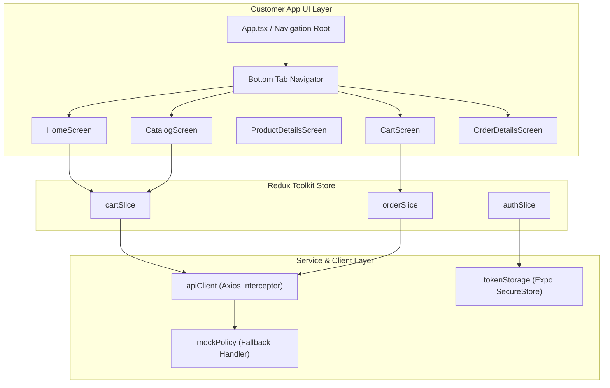

### Customer Navigation Map
```text
AppNavigator Root
 ├── AuthStack
 │    ├── LoginScreen
 │    ├── RegisterScreen
 │    └── OtpVerificationScreen
 └── MainTabNavigator
      ├── HomeStack
      │    ├── HomeScreen
      │    ├── CategoryScreen
      │    └── ServiceBookingScreen
      ├── CatalogStack
      │    ├── CatalogScreen
      │    └── ProductDetailsScreen
      ├── CartStack
      │    ├── CartScreen
      │    └── CheckoutScreen
      └── OrdersStack
           ├── OrderHistoryScreen
           ├── OrderDetailsScreen
           └── LiveTrackingScreen
```

---

## 9. Plumber Application Architecture

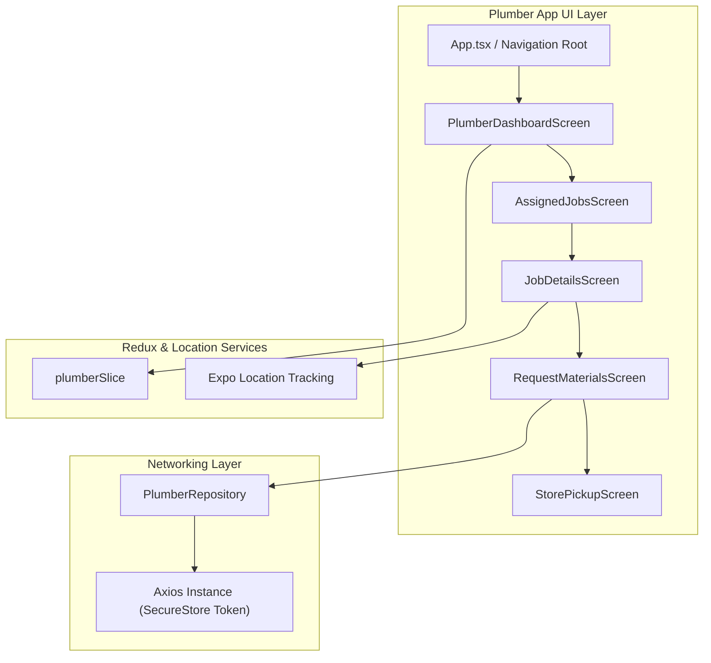

---

## 10. Store Application Architecture

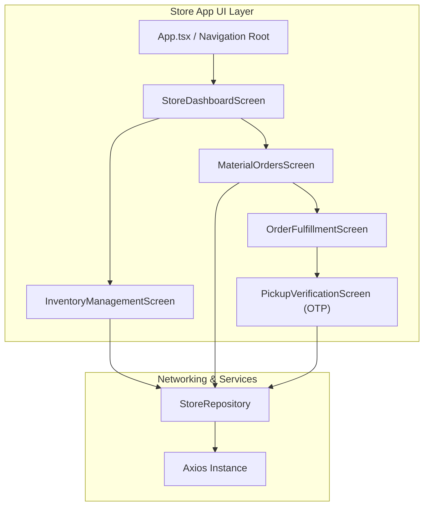

---

## 11. Cross-Application Workflow Architecture

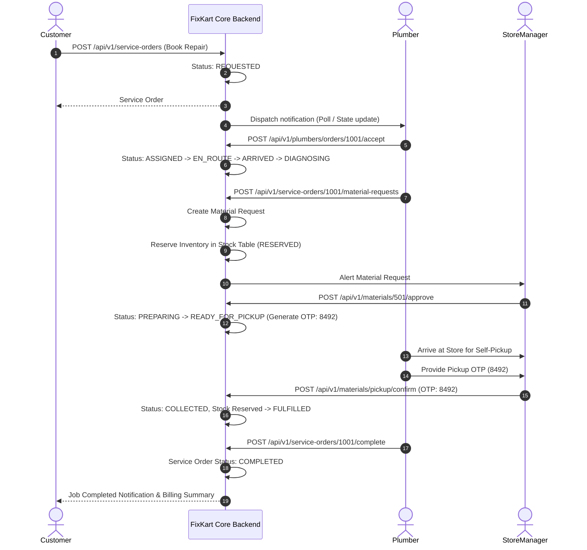

---

## 12. Service Order & Material Request State Machines

### Service Order State Machine
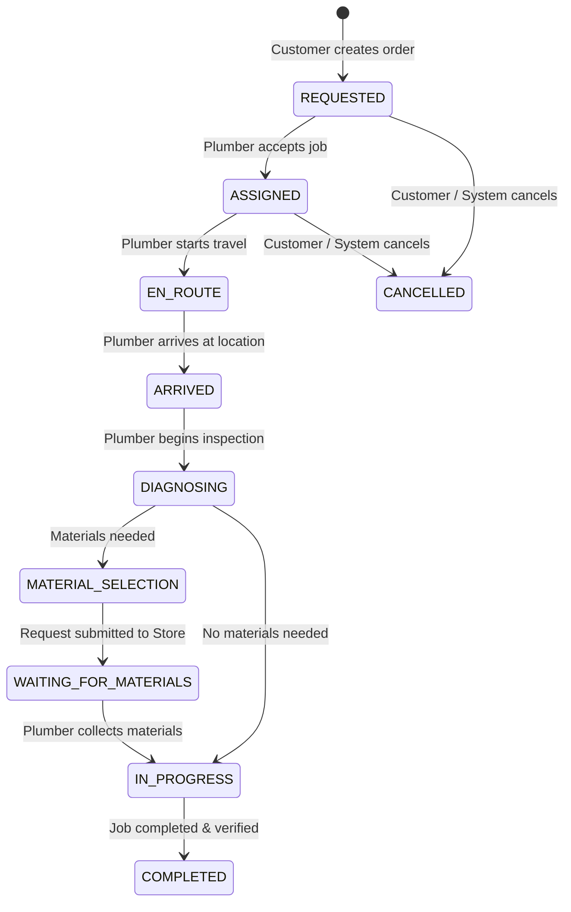

### Material Request State Machine
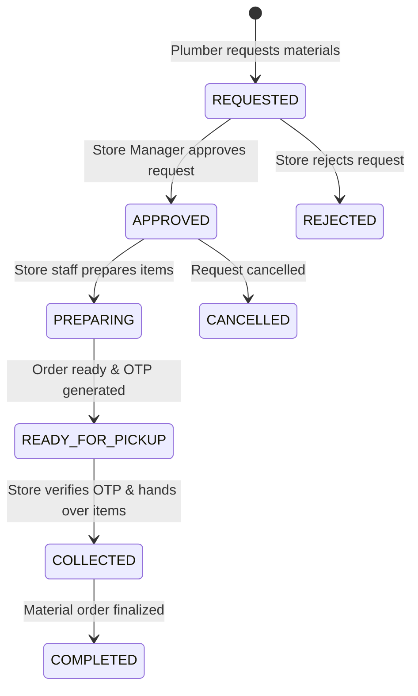

---

## 13. Inventory Reservation Model

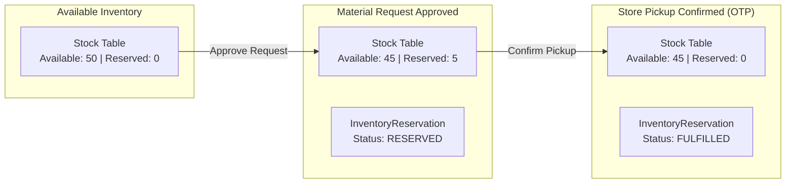

---

## 14. Deployment Architecture

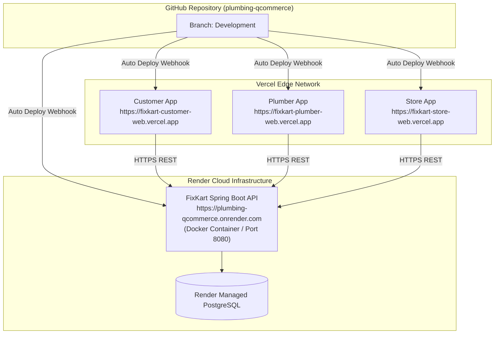

---

## 15. Observability & Health Indicators

- **Liveness Endpoint**: `GET /health/live` $\rightarrow$ Returns `HTTP 200 OK` (`{"status":"UP"}`) for Render/load balancer health checks.
- **Readiness Endpoint**: `GET /health/ready` $\rightarrow$ Returns `HTTP 200 OK` when Spring ApplicationContext and DB connections are active.
- **Actuator Health**: `GET /actuator/health` $\rightarrow$ Spring Boot Actuator monitoring database connectivity, disk space, and core components.
- **Version Endpoint**: `GET /version` $\rightarrow$ Exposes build commit SHA (`b2dacdb0dd17fdaa2ccc287e224b30dcb726501c`), active Spring profile, and runtime environment.

---

## 16. Technical Debt & Risks Matrix

| Risk ID | Risk Area | Technical Debt Description | Severity | Mitigation Strategy |
| --- | --- | --- | --- | --- |
| **TD-01** | Frontend Mock Policy | Dev mock fallbacks present in client repositories when backend is unreachable | Medium | Enforce strict production feature flags disabling mock fallbacks in release builds |
| **TD-02** | Cross-App Synchronization | Apps use short-polling for state updates rather than persistent WebSockets | Medium | Implement WebSocket/STOMP push notification server for real-time plumber dispatch |
| **TD-03** | Test Isolation | Vitest tests run against Node environment requiring require/asset transformer stubs | Low | Add dedicated Vite/Vitest asset transform plugin for binary Expo image assets |
| **TD-04** | API Contract Duplication | API interfaces duplicated across 3 client apps (`Customer`, `Plumber`, `Store`) | Medium | Extract shared API client & DTO TypeScript package (`@fixkart/api-client`) |

---

## 17. Recommended Future Architecture

1. **Shared Contract Package**: Consolidate TypeScript models and API client code into a shared workspace package (`packages/api-client`).
2. **Event-Driven Push Engine**: Introduce WebSocket/STOMP brokers for real-time plumber location tracking and instant store pickup alerts.
3. **Redis Session Caching**: Fully activate Redis token caching for instant access token invalidation and distributed lock management on inventory.
