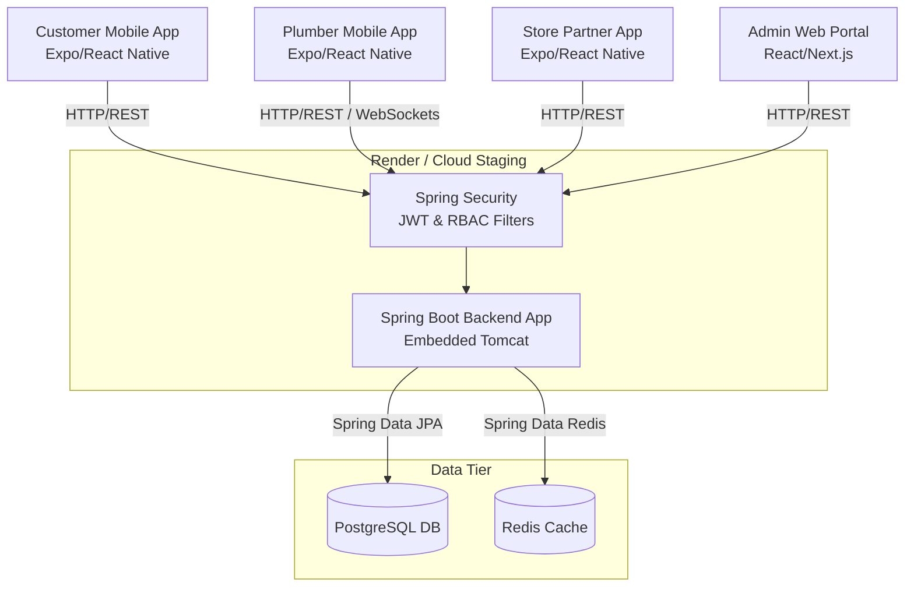
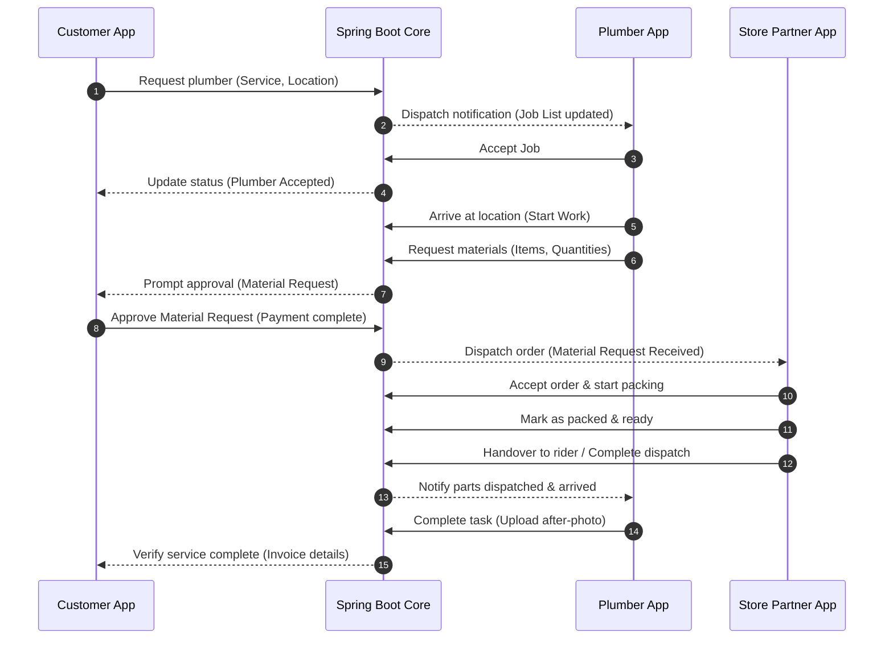

# FixKart Architecture Documentation

This document describes the design, subsystems, communication patterns, database entities, and security framework of **FixKart**, a hyper-local plumbing service and parts fulfillment platform.

---

## 1. Architecture Overview

FixKart follows a micro-frontend-like mobile client structure backed by a consolidated monolithic core API. It employs a role-based modular architecture to deliver real-time capabilities to four primary user classes: Customers, Plumbers, Store Managers, and Admins.

---

## 2. Role-Based Applications

FixKart provides custom clients tailored to each actor's lifecycle requirements:

### A. Customer App (`customer-app`)
- **Objective**: Direct client interface for booking repairs and tracking plumbers.
- **Key Modules**:
  - Auth: Email/OTP validation.
  - Plumber Booking: Service selection, location selection, plumber tracking.
  - Material Approvals: Checklist validation, payment authorization.
  - History & Tracking: Real-time service order states.

### B. Plumber App (`plumber-app`)
- **Objective**: Field agent tool for accepting, routing, and completing repair jobs.
- **Key Modules**:
  - Job Pipeline: Incoming job notification, accept/decline action.
  - Navigation: Customer address display, route mapping, check-in flow.
  - Material Request Generator: Selection of materials from catalog, submission of requests.
  - Job Lifecycle Management: Before/after photo uploads, final work signoff.

### C. Store Partner App (`store-app`)
- **Objective**: Fulfillment interface for local hardware store partners.
- **Key Modules**:
  - Order Fulfillment: Active requests queue, packing checks, status updates.
  - Inventory management: Stock level monitoring, low-stock warnings, catalog adjustments.
  - Dispatch Dashboard: Rider assignment, payout tracker.

### D. Admin Portal (`admin-portal`)
- **Objective**: Control panel for administrators to govern platform status, adjust access roles, and resolve disputes.
- **Key Modules**:
  - Role-based Access Control (RBAC): SuperAdmin, FinanceAdmin, OperationsAdmin, SupportAdmin, MarketingAdmin dashboards.
  - Job & Order Monitors: Operational overview of all orders.
  - User governance: Customer, plumber, and store registrations.

---

## 3. Backend Architecture

The backend is built as a Spring Boot application using Spring Web, Spring Security, Spring Data JPA, and dynamic caching.

### Core Modules:
- **Authentication**: JWT-based stateless authentication system. Custom authorization filter maps roles (`ROLE_CUSTOMER`, `ROLE_PLUMBER`, `ROLE_STORE`, `ROLE_ADMIN`) to specific controller routes.
- **Job Engine**: Orchestrates transitions for `ServiceOrder` status flags (`PENDING`, `ACCEPTED`, `ARRIVED`, `STARTED`, `COMPLETED`).
- **Fulfillment Engine**: Manages pipeline for material requests from request through store packing, rider delivery, and confirmation.
- **Analytics & Forecaster**: Mock-backed AI forecasts and historical volume analytics for store partners.

---

## 4. Database Schema and Storage

Data persistence is managed via **PostgreSQL** with schema evolution handled by **Flyway Migrations**. Key tables include:
- `users`: Core account details (id, email, password, active role).
- `user_roles`: Maps accounts to system roles.
- `service_orders`: Records service category, plumber ID, customer ID, current job status, before/after image URIs.
- `material_requests`: Records associated service order ID, target store ID, payment status, approval status, total amount.
- `material_request_items`: Line-item breakdown of products, quantity, unit prices.
- `inventory`: Tracks stock level of products at each store.

---

## 5. Security & Authentication Model

### Token-Based Access Control
- All request endpoints (excluding `/auth/login`, `/auth/register`, and `/health`) are secured by Spring Security.
- JWT tokens carry the subject ID and user roles, refreshed dynamically to prevent session hijacking.

### Security Enhancements:
1. **SMS/OTP Verification Hardening**: Rate limit controls prevent brute-force attacks on verification screens.
2. **Production Seeder Guards**: Safe staging guards reject bootstrap/seed executions if non-staging profile conditions are detected.
3. **CORS Configuration**: Restricts access in production profile settings to prevent cross-origin scripts.

---

## 6. Main Business Workflow Diagram

---

## 7. Production Readiness Architecture Gaps

1. **Payment Gateway Integration**: Current flow relies on mock checkout bypasses in staging. Direct payment gateway (e.g. Razorpay/Stripe) integration is required.
2. **Native Push Notifications**: WebSocket fallback needs translation to native Firebase Cloud Messaging (FCM) / Apple Push Notification service (APNs).
3. **Distributed Lock Engine**: Inventory decrement actions require distributed locks (e.g., via Redisson) to prevent race conditions during peak q-commerce sales.
