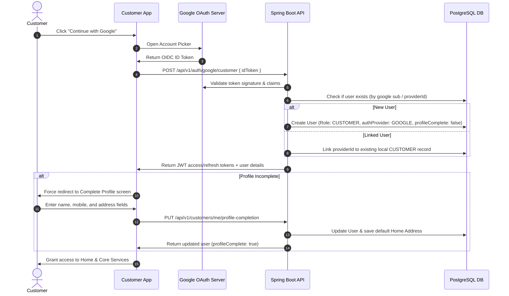

# Customer Google Signup & Profile Completion Guide

This document describes the customer Google Authentication integration and mandatory profile completion workflow introduced in Phase 15A.

---

## 1. Architecture Overview

To streamline customer onboarding and enhance account security, customer registration and authentication now uses **Google Sign-in / OpenID Connect (OIDC)** instead of native SMS OTP code validation.



---

## 2. API Endpoints

### 1. Customer Google Authentication
* **Endpoint**: `POST /api/v1/auth/google/customer`
* **Access**: Public
* **Request Payload**:
  ```json
  {
    "idToken": "eyJhbGciOiJSUzI1NiIs..."
  }
  ```
* **Response Payload (Successful Auth)**:
  ```json
  {
    "accessToken": "eyJhbGciOiJIUzUxMi...",
    "refreshToken": "7c8e9d...",
    "user": {
      "id": 42,
      "email": "customer@gmail.com",
      "fullName": "John Doe",
      "role": "CUSTOMER",
      "phone": null,
      "phoneVerified": false,
      "profileComplete": false,
      "authProvider": "GOOGLE",
      "profileImageUrl": "https://lh3.googleusercontent.com/..."
    }
  }
  ```

### 2. Mandatory Profile Completion
* **Endpoint**: `PUT /api/v1/customers/me/profile-completion`
* **Access**: Authenticated `CUSTOMER` role only
* **Request Payload**:
  ```json
  {
    "fullName": "Akhil",
    "phone": "9876543210",
    "addressLine1": "Flat 304, Green Towers",
    "city": "Hyderabad",
    "state": "Telangana",
    "pincode": "500001",
    "landmark": "Near water tank"
  }
  ```
* **Response Payload**:
  ```json
  {
    "id": 42,
    "email": "customer@gmail.com",
    "fullName": "Akhil",
    "role": "CUSTOMER",
    "phone": "9876543210",
    "phoneVerified": false,
    "profileComplete": true,
    "authProvider": "GOOGLE",
    "profileImageUrl": "..."
  }
  ```

---

## 3. Required Environment Configurations

### Backend Properties (application.properties / yml)
```properties
google.auth.enabled=true
google.auth.web-client-id=<google_web_client_id>
google.auth.android-client-id=<google_android_client_id>
google.auth.ios-client-id=<google_ios_client_id>
google.auth.allowed-client-ids=<web_id>,<android_id>,<ios_id>
```

### Customer App Environment Properties (.env)
```env
EXPO_PUBLIC_GOOGLE_WEB_CLIENT_ID=<google_web_client_id>
EXPO_PUBLIC_GOOGLE_ANDROID_CLIENT_ID=<google_android_client_id>
EXPO_PUBLIC_GOOGLE_IOS_CLIENT_ID=<google_ios_client_id>
```

---

## 4. Key Rules & Constraints

1. **Role Gating**: Only the `CUSTOMER` role can register and authenticate using Google. If the email returned by Google matches an existing user with an `ADMIN`, `PLUMBER`, `STORE_MANAGER`, or `DELIVERY_PARTNER` role, the backend rejects the request with a `403 Forbidden` error to prevent auto-linking Google accounts to privileged roles.
2. **Mandatory Profile Details**:
   - `fullName`: Not blank.
   - `phone`: Valid Indian mobile number pattern (`^(\+91)?[6789]\d{9}$`).
   - `addressLine1`, `city`, `state`, `pincode`: Required (pincode must be exactly 6 digits).
3. **Mobile Number Verification**: In this phase, the mobile number is mandatory but not verified via SMS OTP (`phoneVerified` remains false).
4. **Offline Payments**: All payment integrations are bypassed for now. Checkout flows use "offline/manual/payment-pending" options.
