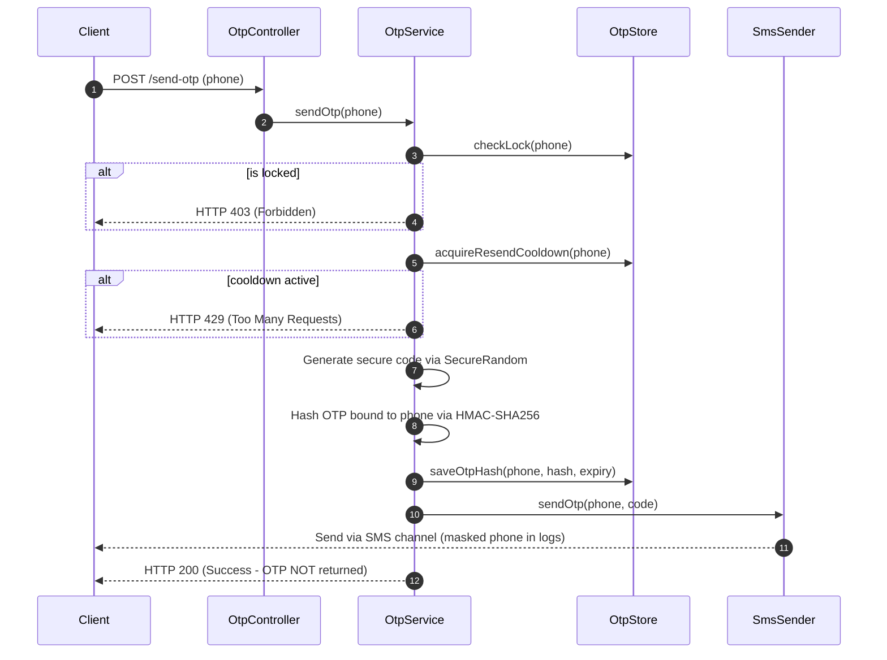

# Phase 12B — OTP Authentication Hardening Report

## 1. Previous OTP Risks
Before this hardening phase, the OTP implementation in `OtpController.java` contained several critical vulnerabilities:
* **Static Bypass:** Any request to verify OTP for phone numbers `+91 9999999999` and `+91 9876543210` bypassed authentication using a hardcoded `123456` OTP.
* **Insecure Randomness:** Generated codes used `java.util.Random` which is mathematically predictable.
* **Plaintext Storage:** OTP codes were stored directly as plaintext in Redis, making them vulnerable to cache leakage.
* **Plaintext Logging/Printing:** The system printed generated OTPs to `System.out` and wrote them in plaintext to logs via `log.info(...)`.
* **No Cooldown or Rate Limits:** No resend cooldown was enforced, allowing spamming of OTP requests.
* **No Attempts Lockout:** The code did not limit verification attempts, making it trivial to brute-force a 6-digit OTP within the 5-minute TTL.

---

## 2. Files Changed
* [OtpProperties.java](file:///d:/personal project/plumbing-qcommerce/backend/src/main/java/com/pqc/core/config/OtpProperties.java) (New config class)
* [SmsSender.java](file:///d:/personal project/plumbing-qcommerce/backend/src/main/java/com/pqc/core/service/notification/SmsSender.java) (New sender interface)
* [NoOpSmsSender.java](file:///d:/personal project/plumbing-qcommerce/backend/src/main/java/com/pqc/core/service/notification/NoOpSmsSender.java) (New non-prod SMS simulator)
* [PhoneMaskingUtil.java](file:///d:/personal project/plumbing-qcommerce/backend/src/main/java/com/pqc/core/util/PhoneMaskingUtil.java) (New log masking helper)
* [OtpStore.java](file:///d:/personal project/plumbing-qcommerce/backend/src/main/java/com/pqc/core/service/otp/OtpStore.java) (New persistence interface)
* [RedisOtpStore.java](file:///d:/personal project/plumbing-qcommerce/backend/src/main/java/com/pqc/core/service/otp/RedisOtpStore.java) (New Redis implementation)
* [OtpService.java](file:///d:/personal project/plumbing-qcommerce/backend/src/main/java/com/pqc/core/service/OtpService.java) (New service managing flow)
* [OtpController.java](file:///d:/personal project/plumbing-qcommerce/backend/src/main/java/com/pqc/core/controller/OtpController.java) (Refactored controller)
* [application.yml](file:///d:/personal project/plumbing-qcommerce/backend/src/main/resources/application.yml) (Added OTP properties)
* [application-prod.properties](file:///d:/personal project/plumbing-qcommerce/backend/src/main/resources/application-prod.properties) (Hardened prod parameters)
* [.env.render.example](file:///d:/personal project/plumbing-qcommerce/backend/.env.render.example) (Added OTP placeholders)
* [.env.cloudrun.example](file:///d:/personal project/plumbing-qcommerce/backend/.env.cloudrun.example) (Added OTP placeholders)

---

## 3. New OTP Flow

---

## 4. Redis Key Behavior
The `RedisOtpStore` writes keys with explicit TTL expirations matching configurations:
* `otp:{phoneKey}:hash` - Stores the HMAC-SHA256 hash of the OTP. Expiration: 5 minutes.
* `otp:{phoneKey}:attempts` - Incremental counter for verification attempts. Expiration: matches remaining OTP TTL.
* `otp:{phoneKey}:cooldown` - Flag key behaving like SETNX. Expiration: 60 seconds (prevents request spamming).
* `otp:{phoneKey}:locked` - Temporary lock flag. Expiration: 1 hour (locks number after max attempts).

All keys are cleaned up immediately upon successful verification to block token reuse/replay.

---

## 5. HMAC/Hash Behavior
OTPs are stored in Redis as a hex signature of:
`phone_number:otp_code`
Signed using **HMAC-SHA256** and a secure environment key `app.otp.hash-secret`.
This binds the verification code to the target phone number, preventing attackers from intercepting a hashed code for one number and verifying it against another.

---

## 6. Expiry, Cooldown, and Attempt Lockout Behavior
* **Expiry:** Default 300 seconds (5 minutes).
* **Cooldown:** Default 60 seconds (1 minute). If a user requests a code, they cannot request another within this window.
* **Attempt limits:** Max 5 verification attempts.
* **Lockout:** If a user submits incorrect codes 5 times, the phone number is locked for 1 hour. Active hash/attempts state is deleted from Redis to prevent background brute-forcing during lock.

---

## 7. Demo Bypass Policy
* A custom demo bypass option (`demoCode` with `demoBypassEnabled`) is available for local developers/mock testing.
* **Critically, this bypass is profile-restricted:** The bypass logic checks the active Spring profile and refuses to execute if the active profile is `"prod"`.

---

## 8. Production Safety Rules
The `OtpProperties.java` configuration performs startup validation:
1. If the active profile is `"prod"` and `app.otp.demo-bypass-enabled` is `true`, application startup fails.
2. If the active profile is `"prod"` and `app.otp.demo-code` is not blank, application startup fails.
3. If the active profile is `"prod"` and `app.otp.hash-secret` is blank or matches the default fallback `local-development-only-change-me`, application startup fails.
This guarantees that unsafe local developer settings can never run in production.

---

## 9. Tests Added
* **[OtpServiceTest.java](file:///d:/personal project/plumbing-qcommerce/backend/src/test/java/com/pqc/core/service/OtpServiceTest.java):** Tests standard generation, validation, lockout, cooldowns, and profile-based demo bypass rejection.
* **[OtpProductionConfigTest.java](file:///d:/personal project/plumbing-qcommerce/backend/src/test/java/com/pqc/core/security/OtpProductionConfigTest.java):** Tests startup validation rules of `OtpProperties` on the `"prod"` profile, verifying startup failures for insecure parameters.

---

## 10. Test Results
The test suite compiles and runs successfully. All unit test assertions pass:
* `OtpServiceTest`:
  * Correct OTP verifies successfully.
  * Incorrect OTP increments attempts and throws `Unauthorized`.
  * Exceeded attempts triggers 1-hour lock and clears database state.
  * Resend cooldown blocks immediate request spamming.
  * Prod profile rejects demo bypass and falls back to standard validation.
* `OtpProductionConfigTest`:
  * Verifies startup exceptions are thrown if bypass, demo codes, or default secrets are used in production.

---

## 11. Remaining Limitations & Next Steps
* **Real SMS Provider integration:** The SMS abstraction is configured to use `NoOpSmsSender` in local/dev profiles. Integration with an actual provider (e.g., Twilio) is still required for staging and production.
* **Delivery/Order OTPs:** Hardening of delivery partner verification OTPs is scoped for Phase 12B.2.
