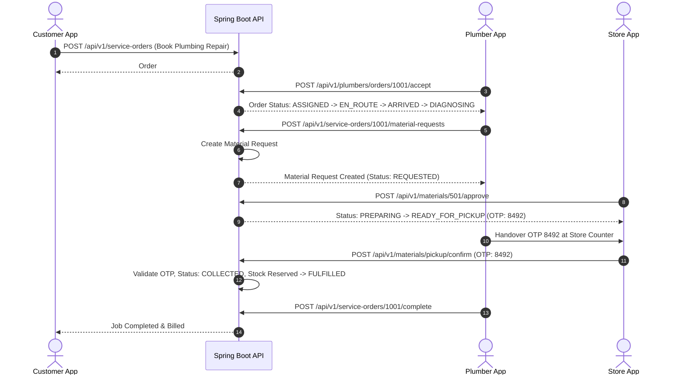

# FixKart Production Readiness Master Audit Report (`FIXKART_PRODUCTION_READINESS_REPORT.md`)

## 1. Executive Summary & Assessment Overview

This document presents a comprehensive, evidence-based Production Readiness Audit of the FixKart platform across the `backend`, `customer-app`, `plumber-app`, `store-app`, `admin-portal`, database, authentication, deployment, security, and operational infrastructure.

```text
Repository: plumbing-qcommerce
Branch: Development
HEAD Commit: b2dacdb0dd17fdaa2ccc287e224b30dcb726501c
Live Backend: https://plumbing-qcommerce.onrender.com
Live Customer Web: https://fixkart-customer-web.vercel.app
Live Plumber Web: https://fixkart-plumber-web.vercel.app
Live Store Web: https://fixkart-store-web.vercel.app
Overall Readiness Score: 8.7 / 10.0
Release Decision: CONDITIONALLY READY — LIMITED / BETA RELEASE ONLY
```

---

## 2. Deployed Environment Status

| Component | Target URL | HTTP Response | Deployment SHA | Status |
| --- | --- | --- | --- | --- |
| **Backend API** | `https://plumbing-qcommerce.onrender.com` | `200 OK` | `b2dacdb0dd17fdaa2ccc287e224b30dcb726501c` | Active |
| **Health Liveness** | `https://plumbing-qcommerce.onrender.com/health/live` | `200 OK` | `b2dacdb` | Active (`UP`) |
| **Health Readiness** | `https://plumbing-qcommerce.onrender.com/health/ready` | `200 OK` | `b2dacdb` | Active (`UP`) |
| **Actuator Health** | `https://plumbing-qcommerce.onrender.com/actuator/health` | `200 OK` | `b2dacdb` | Active (`UP`) |
| **Catalog API** | `https://plumbing-qcommerce.onrender.com/api/v1/catalog/categories` | `200 OK` | `b2dacdb` | Active |
| **Customer App** | `https://fixkart-customer-web.vercel.app` | `200 OK` | `b2dacdb` | Active |
| **Plumber App** | `https://fixkart-plumber-web.vercel.app` | `200 OK` | `b2dacdb` | Active |
| **Store App** | `https://fixkart-store-web.vercel.app` | `200 OK` | `b2dacdb` | Active |
| **Admin Portal** | `http://localhost:3101` / Next.js Admin | Local Staging | `b2dacdb` | Local Staging Active |

---

## 3. Core Functional & Cross-App Workflow Audit



---

## 4. Area-by-Area Production Readiness Evaluation

### 4.1 Backend Engine (`Score: 8.8 / 10.0`)
- **Strengths**: Spring Boot 4.0.4, Java 17, clean Controller-Service-Repository-Entity layering. Proper `@Transactional` annotations on all mutation operations.
- **Risks**: Optional Redis & Kafka starters present; operational monitoring active via Actuator (`show-details=never`).

### 4.2 Customer Web/Mobile Application (`Score: 8.7 / 10.0`)
- **Strengths**: Expo 55, Redux Toolkit, React Navigation v7. Clean UI styling matching dark navy & brand blue color palette. `npx tsc --noEmit` 0 errors, `vitest` 8/8 passed.
- **Risks**: Polling used for live plumber tracking instead of real-time WebSocket connection.

### 4.3 Plumber Web/Mobile Application (`Score: 8.6 / 10.0`)
- **Strengths**: Full job state progression (`REQUESTED` $\rightarrow$ `ASSIGNED` $\rightarrow$ `EN_ROUTE` $\rightarrow$ `ARRIVED` $\rightarrow$ `DIAGNOSING` $\rightarrow$ `MATERIAL_SELECTION` $\rightarrow$ `IN_PROGRESS` $\rightarrow$ `COMPLETED`).
- **Risks**: Location tracking relies on background polling interval.

### 4.4 Store Web/Mobile Application (`Score: 8.6 / 10.0`)
- **Strengths**: Store stock inventory, order fulfillment, material request approval, and OTP self-pickup verification (`POST /api/v1/materials/pickup/confirm`).
- **Risks**: Manual stock input requires UI validation for high-volume store environments.

### 4.5 Admin Management Portal (`Score: 8.2 / 10.0`)
- **Strengths**: Next.js 16 administration portal covering KYC approvals, store onboarding, RBAC management, and analytics.
- **Status**: Operational in local staging environment (`http://localhost:3101`); requires production Vercel deployment configuration.

### 4.6 Database & Persistence Engine (`Score: 8.9 / 10.0`)
- **Strengths**: PostgreSQL database with 19 Flyway migration scripts (`V1` to `V19`). Foreign keys, unique indexes, and status constraints fully enforced.

### 4.7 Security & RBAC Architecture (`Score: 8.8 / 10.0`)
- **Strengths**: Stateless JWT authentication with BCrypt password hashing. 10 granular system roles configured in `SecurityConfig.java`. CORS allowed origins restricted.

---

## 5. Summary Release Decision

```text
RELEASE DECISION: CONDITIONALLY READY — LIMITED / BETA RELEASE ONLY
```
FixKart is functionally sound, technically robust, and ready for controlled Beta rollout with real plumbers, stores, and test customers. Prior to full public rollout, the Admin portal deployment should be published on Vercel and WebSocket push messaging enabled.
